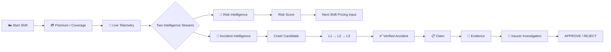
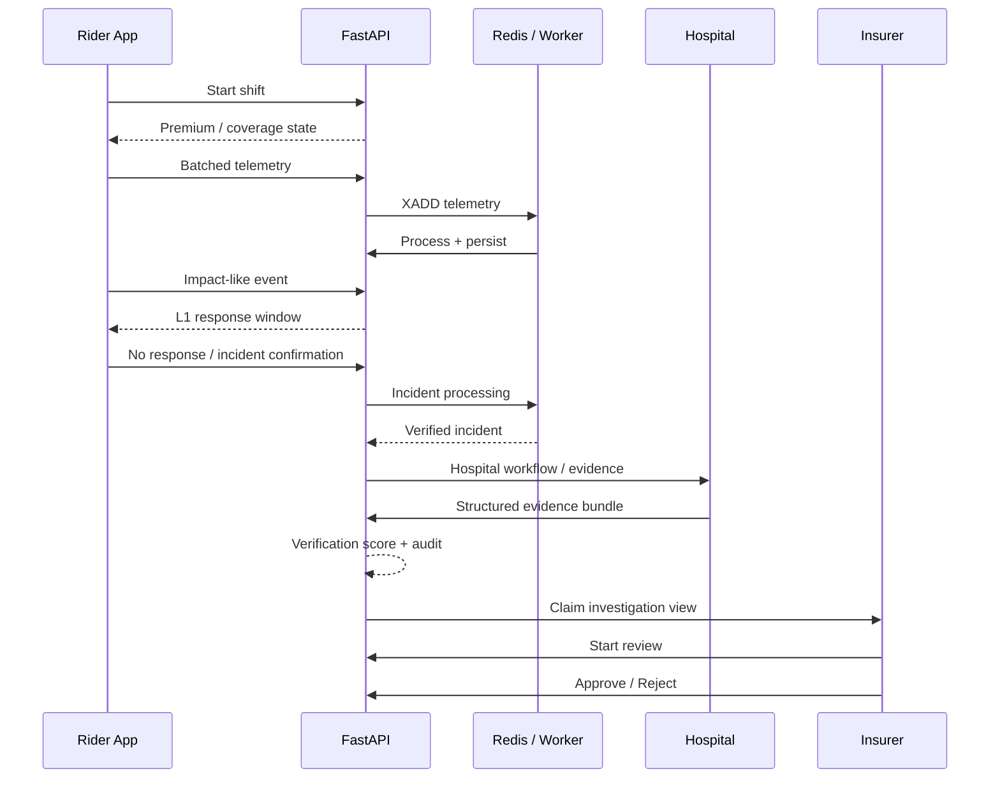
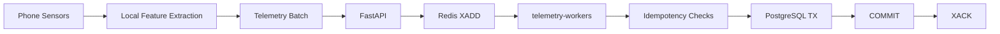
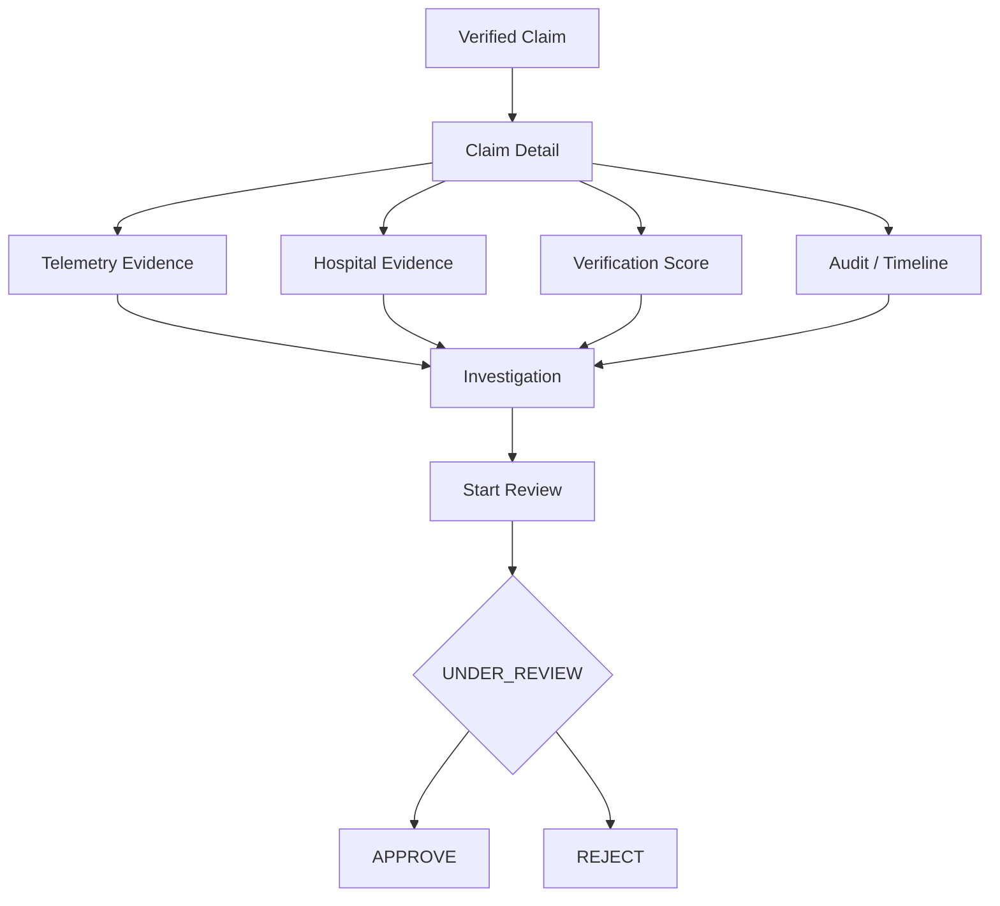

<div align="center">

# 🏍️🛡️ RideShield

### SHIFT-AWARE PROTECTION · TELEMATICS · ACCIDENT INTELLIGENCE · EVIDENCE-DRIVEN CLAIMS

[](#-what-is-live-vs-what-is-not)
[](#-technology)
[](#-technology)
[](#-technology)
[](#-engineering-proof)

<br/>

### 🚀 Try RideShield

[](https://ride-shield-amber.vercel.app/)
&nbsp;&nbsp;
[](https://github.com/atharva7406/RideShield/releases/latest/download/RideShield.apk)

<br/>

<sub>*Android APK demo package is hosted and distributed via [GitHub Releases](https://github.com/atharva7406/RideShield/releases).*</sub>

<br/><br/>

<a href="#-the-idea">THE IDEA</a> ·
<a href="#-live-system">LIVE SYSTEM</a> ·
<a href="#-architecture">ARCHITECTURE</a> ·
<a href="#-evidence--verification">VERIFICATION</a> ·
<a href="#-run-locally">RUN LOCALLY</a>

<br/><br/>


> **Pay when you work. Understand how you ride. Verify before you claim.**

</div>

---

## ⚡ The Idea

Gig work is not a fixed-time exposure.

RideShield makes the **shift** the unit connecting coverage, telemetry, risk, accident verification and claims.



### What makes the system different

| Shift-based | Dual intelligence | Evidence-driven |
|---|---|---|
| Coverage aligns with the rider's working shift. | Risk scoring and accident detection remain separate streams. | Claims can carry telemetry + hospital evidence + an explainable verification result. |

RideShield is a **technology layer for licensed-insurer integration**, not a standalone insurer.

---

# 🎥 Live System

RideShield is an end-to-end deployed, demonstrable system connecting a live mobile rider client, background stream telemetry workers, hospital evidence verification, and an active insurer investigation portal.

<div align="center">

</div>

### One incident. Multiple independent checks.

```text
SENSOR SIGNAL
     │
     ▼
ON-DEVICE CRASH-SIGNATURE FILTER
     │
     ├──────────── normal ───────────→ keep monitoring
     │
     ▼
XGBOOST CRASH CLASSIFIER
     │
     ▼
L1 · FULL-SCREEN RIDER RESPONSE
     │
     ├── "I'm OK" ───────────────────→ close candidate
     │
     ▼
L2 · SMS / WHATSAPP / IVR
     │
     ▼
L3 · GPS + MOTION + ORIENTATION + POST-IMPACT STATE
     │
     ▼
VERIFIED ACCIDENT
     │
     ▼
CLAIM + EVIDENCE
```

> **Design rule:** `ML prediction ≠ claim approval ≠ insurance payout`

---

## 🧭 The Complete Claim Journey



---

# 🏗 Architecture

<div align="center">

</div>

### Repository ownership

```text
RideShield/
│
├── backend/                 → FastAPI application + business logic
├── db/                      → PostgreSQL / Neon models + migrations
├── redis/                   → Redis / Upstash streams + workers
├── db_test_backend/         → infrastructure integration-test harness
├── rider-app/               → React Native / Expo
├── insurer-dashboard/       → React / Vite insurer portal
│
├── docs/
│   ├── database/
│   └── assets/
│
└── README.md
```

The important boundary is:

```text
backend/           = application truth
db/                = relational data truth
redis/             = event-processing truth
db_test_backend/   = testing only
```

---

# 📡 Telemetry Pipeline

RideShield does not need to push every raw sensor sample directly into the database.



### Reliability contract

```text
DB SUCCESS
    ↓
COMMIT
    ↓
XACK ✅

DB FAILURE
    ↓
ROLLBACK
    ↓
NO XACK
    ↓
MESSAGE REMAINS PENDING
    ↓
XAUTOCLAIM
    ↓
SAFE RETRY
```

Telemetry idempotency is protected using both:

```text
UNIQUE(redis_stream_id)
UNIQUE(shift_id, batch_sequence)
```

and the claim model enforces:

```text
UNIQUE(claims.incident_id)
```

---

# 🧠 Dual Intelligence

## 01 · Risk Intelligence

```text
GPS / SENSOR DATA
       ↓
BEHAVIOUR FEATURES
       ↓
RISK XGBOOST
       ↓
┌─────────────────┐
│ LOW / MED / HIGH│
└─────────────────┘
       ↓
PRICING INPUT
       ↓
NEXT-SHIFT PREMIUM
```

The risk signal is intended to feed a partner-calibrated pricing model; it is not presented as a complete actuarial model.

## 02 · Accident Intelligence

```text
ACCELEROMETER + GYROSCOPE + GPS
              ↓
      ROLLING SENSOR WINDOW
              ↓
   DETERMINISTIC CRASH FILTER
              ↓
        XGBOOST CLASSIFIER
              ↓
 ┌─────────────────────────────┐
 │ Normal / Braking / Pothole  │
 │ Sharp Turn / Crash          │
 └─────────────────────────────┘
              ↓
        VERIFICATION LAYERS
```

The current crash classifier is described as a **five-class XGBoost model**:

`Normal · Hard Braking · Pothole · Sharp Turn · Crash`

---

# 🚨 L1 → L2 → L3

| Layer | What happens | Gate |
|---|---|---|
| **L1** | On-device full-screen alert + response countdown | Rider can dismiss as **I'm OK** |
| **L2** | Secondary escalation via SMS / WhatsApp / IVR architecture | Triggered when there is no rider response |
| **L3** | GPS + motion + orientation + post-impact validation | Required before the incident becomes a verified accident |

This is intentionally **not**:

```text
crash detected → claim
```

It is:

```text
candidate
   ↓
response
   ↓
escalation
   ↓
multi-signal verification
   ↓
verified accident
```

---

# 🏥 Evidence → Verification

<div align="center">

</div>

The hospital workflow supports a structured multi-document bundle:

```text
Admission Report
Hospital Bill
Prescription
Discharge Summary
Diagnostic / Lab Report
Other Supporting Document
```

Each document carries structured metadata such as:

`patient · facility · locality · admission time · document type · diagnosis/notes · filename · MIME type · size · file reference`

### Six-factor verification model

| Factor | Max |
|---|---:|
| Patient Identity | 30 |
| Incident Time | 20 |
| Locality | 15 |
| Document Completeness | 15 |
| Diagnosis Consistency | 10 |
| Claim Metadata | 10 |
| **TOTAL** | **100** |

The **backend owns the score**. The insurer UI only renders the authoritative result.

### Important implementation choice

RideShield does **not** use OCR, PDF extraction, computer vision or LLM document scanning for this verification flow.

The hospital representative enters structured evidence; the backend verifies that information against claim/rider context.

---

# 🔎 Insurer Investigation



The insurer sees a combined investigation surface rather than isolated data sources:

```text
RIDER
SHIFT
GPS / INCIDENT
TELEMETRY
HOSPITAL EVIDENCE
VERIFICATION SCORE
FACTOR BREAKDOWN
AUDIT EVENTS
CLAIM STATUS
```

Approve/Reject is gated to `UNDER_REVIEW`, and decisions are recorded rather than silently overwritten.

---

# 🧪 Engineering Proof

<div align="center">

</div>

### Verified testing milestones

```text
27 / 27  hospital + insurer integration
20 / 20  Phase 4 investigation
17 / 17  Phase 3 verification
 5 /  5  telemetry infrastructure
```

Coverage included:

- multi-document evidence
- score sensitivity
- identity / time / locality mismatches
- verification persistence
- deterministic latest-successful retrieval
- hospital authorization
- claim isolation
- evidence deletion
- review gating
- approve/reject idempotency
- server-authoritative verification
- Redis telemetry processing
- rollback / recovery / redelivery

The test counts above are project verification results, not synthetic marketing metrics.

---

# 💳 Payment & External Services

```text
                 RIDESHIELD
                     │
       ┌─────────────┼─────────────┐
       ▼             ▼             ▼
   RAZORPAY       TWILIO         OVERPASS
   payments       escalation     hospitals
   sandbox         / WA           / OSM
```

### Razorpay

```text
START SHIFT
   ↓
PREMIUM
   ↓
RAZORPAY TEST CHECKOUT
   ↓
BACKEND VERIFICATION
   ↓
PAYMENT PERSISTED
   ↓
COVERAGE ACTIVATED
```

**Razorpay is treated as test/sandbox infrastructure in the prototype.**

### Twilio / WhatsApp

Used in the secondary accident-escalation architecture.

### OpenStreetMap / Overpass

Used for GPS-to-hospital matching.

---

# 🛡️ Security & Integrity

RideShield keeps the important decisions on the server.

```text
Frontend
   │
   ├── cannot authoritatively set verification_score
   ├── cannot bypass claim isolation
   ├── cannot access another hospital's claim
   ├── cannot decide a claim outside UNDER_REVIEW
   └── cannot turn an ML prediction into a payout
```

### Core guarantees

**Server-authoritative verification**  
The backend returns the score and breakdown; the frontend does not reconstruct it.

**Claim isolation**  
Evidence belongs to a specific claim.

**Hospital isolation**  
Hospital-side access is validated server-side.

**Auditability**  
Verification runs and insurer decisions leave an audit trail.

**Deterministic retrieval**  
Latest successful verification resolves using `created_at DESC, id DESC`.

---

# 📱 Product Surfaces

<div align="center">

| Rider App (Android) | Hospital Evidence Workflow | Insurer Portal (Web) |
|---|---|---|
| Shift control & status | Claim authorization access | Live claim queue & filters |
| Background telemetry collection | Multi-document bundle upload | Unified claim investigation |
| L1 crash alert & response | Structured metadata entry | High-resolution telemetry review |
| Dynamic risk score & pricing | Verification score feedback | Server-authoritative 6-factor score |
| Incident history & claims | Evidence file management | Manual review gating (Approve / Reject) |
| Sandbox premium payment | Isolation per claim ID | Incident audit trail & history |

</div>

- **Rider App**: Distributed directly as an [Android demo APK](https://github.com/atharva7406/RideShield/releases/latest/download/RideShield.apk) (`v1.0.0`) with sensor telematics, crash detection, and shift lifecycle management.
- **Insurer Portal**: Deployed live as a responsive web application on [Vercel](https://ride-shield-amber.vercel.app/) with investigation workspaces, telemetry drill-down, and authoritative decision gating.
- **Hospital Evidence Workflow**: Integrated directly into the backend API and claim lifecycle, enabling authorized hospital representatives to submit and manage structured medical evidence bundles.

---

# 🗺️ Roadmap

<div align="center">

</div>

```text
COMPLETED · DEPLOYED DEMO MILESTONE
 │
 ├── ✅ Shift-based micro-coverage & state lifecycle
 ├── ✅ Real-time sensor telemetry & Redis stream workers
 ├── ✅ Dual intelligence (XGBoost crash classification & risk scoring)
 ├── ✅ Multi-tier accident escalation (L1 / L2 / L3 multi-signal verification)
 ├── ✅ Structured hospital evidence bundle & 6-factor server scoring
 ├── ✅ Insurer investigation portal with audit trail & review gating
 ├── ✅ 27/27 end-to-end integration test harness
 ├── ✅ Web Insurer Portal deployed on Vercel
 └── ✅ Android Rider APK distributed via GitHub Releases (v1.0.0)
 │
 ▼
NEXT · PRODUCTION READINESS
 │
 ├── ⏳ Licensed insurer & underwriter API integration
 ├── ⏳ Production automated payout rails & banking integration
 ├── ⏳ Controlled real-world rider field trials & fleet pilot
 ├── ⏳ High-concurrency telemetry load & resilience validation
 ├── ⏳ Multi-terrain, multi-sensor ML model calibration
 └── ⏳ Enterprise compliance, consent & data privacy controls
```

---

# ✅ What Is Live vs. What Is Not

<table>
<tr>
<th>🟢 LIVE / DEPLOYED</th>
<th>🟡 DEMO / SANDBOX</th>
<th>🔵 NOT YET PRODUCTION</th>
</tr>
<tr>
<td valign="top">

• <b>Rider Android Demo APK</b> (v1.0.0 via GitHub Releases)<br/>
• <b>Deployed Insurer Portal</b> (Vercel)<br/>
• <b>FastAPI Backend Engine</b><br/>
• <b>PostgreSQL / Neon Database</b><br/>
• <b>Redis Telemetry Pipeline & Stream Workers</b><br/>
• <b>Shift & Coverage Lifecycle</b><br/>
• <b>Multi-Document Hospital Evidence Workflow</b><br/>
• <b>Server-Authoritative 6-Factor Verification</b><br/>
• <b>Insurer Investigation & Decision Workspace</b><br/>
• <b>Incident Audit Trail & History</b><br/>
• <b>27/27 Passing Integration Suite</b>

</td>
<td valign="top">

• <b>Razorpay Test/Sandbox Flow</b><br/>
• <b>Secondary Escalation Architecture</b> (SMS / WhatsApp / IVR)<br/>
• <b>Prototype Risk & Pricing Logic</b><br/>
• <b>5-Class XGBoost Crash Classifier</b><br/>
• <b>Prototype Verification Heuristics</b>

</td>
<td valign="top">

• <b>Licensed Insurer System Integration</b><br/>
• <b>Production Payout Infrastructure & Banking Rails</b><br/>
• <b>Controlled Real-World Rider Fleet Trials</b><br/>
• <b>Large-Scale High-Throughput Load Validation</b><br/>
• <b>Broader Real-World Multi-Device ML Validation</b><br/>
• <b>Fully Calibrated Actuarial Pricing Models</b><br/>
• <b>Formal Privacy, Consent & Regulatory Compliance</b>

</td>
</tr>
</table>

---

# 🧰 Technology

<div align="center">


<br/><br/>

**Mobile** · React Native · Expo · TypeScript  
**Web** · React · Vite · Tailwind  
**Backend** · Python · FastAPI  
**Data** · PostgreSQL · Neon · SQLAlchemy · Alembic  
**Events** · Redis / Upstash · Redis Streams · Workers  
**ML** · XGBoost  
**Integrations** · Razorpay · Twilio / WhatsApp · OpenStreetMap / Overpass  
**Delivery** · Git · GitHub Releases · Vercel

</div>

---

# 🚀 Run Locally

### 1. Backend

```bash
cd backend

python -m venv venv

# Windows
.\venv\Scripts\activate

# macOS / Linux
# source venv/bin/activate

pip install -r requirements.txt

uvicorn main:app --reload --host 0.0.0.0 --port 8000
```

### 2. Insurer Dashboard

```bash
cd insurer-dashboard
npm install
npm run dev
```

### 3. Rider App

```bash
cd rider-app
npm install
npx expo start --clear
```

### 4. Database / Redis

Configure the repository's environment variables for PostgreSQL/Neon and Redis/Upstash before starting the application.

Typical sensitive values include:

```env
DATABASE_URL=
REDIS_URL=
REDIS_TOKEN=
RAZORPAY_KEY_SECRET=
TWILIO_AUTH_TOKEN=
```

Never commit real credentials.

---

# 📂 Repository Map

```text
backend/
  application / REST / business logic

db/
  SQLAlchemy models
  Alembic migrations
  database utilities

redis/
  stream client
  producers
  workers
  infrastructure tests

db_test_backend/
  DB / Redis integration harness

rider-app/
  React Native / Expo mobile client

insurer-dashboard/
  React / Vite insurer client

docs/
  database/
  assets/
```

---

# 🧠 Design Principles

```text
EDGE FIRST
        ↓
PROCESS ONLY WHAT MATTERS

QUEUE BEFORE HEAVY PROCESSING
        ↓
ABSORB BURSTS / DECOUPLE WORK

SERVER AUTHORITATIVE
        ↓
CLIENTS RENDER STATE

MULTI-SIGNAL VERIFICATION
        ↓
NO SINGLE SENSOR → CLAIM

HUMAN FINAL DECISION
        ↓
ML ASSISTS, INSURER DECIDES
```

---

# ⚠️ Prototype Scope

```text
DEPLOYED DEMO
      ≠
PRODUCTION INSURANCE PLATFORM
```

RideShield is currently a **deployed, fully demonstrable pilot-stage technology platform**, not a nationally regulated insurance carrier or underwriting entity.

The complete architecture—including the Android mobile application, real-time telemetry stream pipeline, dual intelligence models, hospital verification engine, and insurer web dashboard—is live and functional for demonstration, pilot evaluation, and integration verification.

Full commercial production insurance deployment would still require:
- Direct API integration with licensed insurance carriers and underwriters
- Production banking payout rails and automated disbursement infrastructure
- Controlled real-world rider field trials and multi-device sensor calibration
- Large-scale high-throughput load and resilience validation
- Actuarial rate filing and formal regulatory underwriting clearance
- Enterprise data privacy, consent management, and compliance controls

The project therefore clearly distinguishes between:

`🟢 LIVE / DEPLOYED` · `🟡 DEMO / SANDBOX` · `🔵 NOT YET PRODUCTION`

---

<div align="center">

### 🏍️ RIDESHIELD

**Protect the shift. Verify the incident. Explain the claim.**

<br/>

`TELEMETRY` → `INTELLIGENCE` → `VERIFICATION` → `EVIDENCE` → `DECISION`

<br/>

<sub>Built as a technology layer for gig-worker protection and licensed-insurer integration.</sub>

</div>

---

### Sources & design notes

This README uses GitHub-supported Markdown/HTML structures and Mermaid diagrams for architecture and process visualization. GitHub documents Mermaid support directly in Markdown files.

The animated assets are intentionally self-contained repository assets rather than depending on a pile of external widgets; self-contained SVG/GIF approaches are widely used in modern GitHub README design, including animated profile examples.

The technology icon strip uses the same compact icon-matrix approach popularized by README skill-icon tooling.
